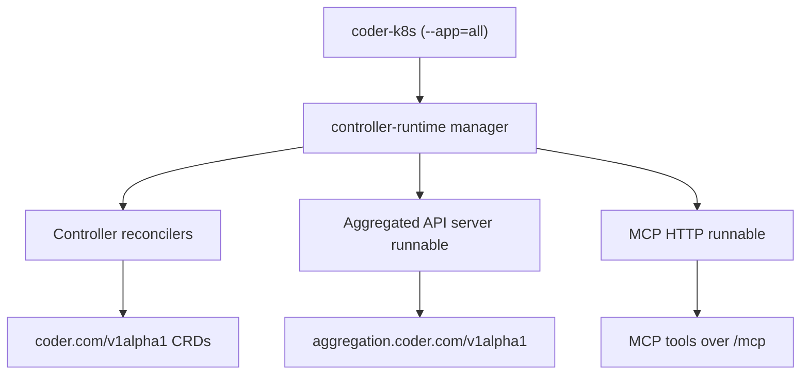
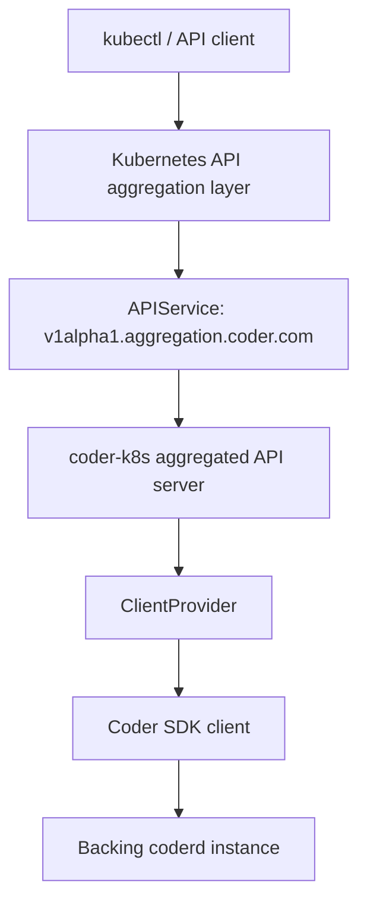

# Architecture

`coder-k8s` is a single Go binary that can run different components depending on the `--app` flag.

## Application modes

| Mode | Purpose | Default |
| --- | --- | --- |
| `all` | Runs controller + aggregated API server + MCP HTTP server in one process | ✅ |
| `controller` | Runs only the controller-runtime manager and reconcilers |  |
| `aggregated-apiserver` | Runs only the aggregated API server (`aggregation.coder.com/v1alpha1`) |  |
| `mcp-http` | Runs only the MCP HTTP server |  |

!!! note
    `--app` is optional. If omitted, `coder-k8s` defaults to `--app=all`.

## Default process model (`--app=all`)

In `all` mode, `internal/app/allapp` creates one shared controller-runtime manager and cache, then:

1. Registers controller reconcilers.
2. Starts aggregated API server as a non-leader runnable.
3. Starts MCP HTTP server as a non-leader runnable.

This keeps component startup coordinated and avoids separate cache/process management for local and demo deployments.

## Controller subsystem

Controller behavior lives in:

- `internal/app/controllerapp/`
- `internal/controller/`

Key facts:

- Uses controller-runtime with leader election.
- Exposes health probes on `:8081` (`/healthz`, `/readyz`).
- Reconciles three CRDs in `coder.com/v1alpha1`:
  - `CoderControlPlane`
  - `CoderProvisioner`
  - `CoderWorkspaceProxy`

For `CoderControlPlane`, the reconciler creates/updates a Deployment + Service in the same namespace, and writes status fields such as `status.url`, `status.phase`, and operator token references.

## Aggregated API subsystem

Aggregated API server behavior lives in:

- `internal/app/apiserverapp/`
- `internal/aggregated/storage/`
- `internal/aggregated/coder/`

Key facts:

- Serves HTTPS on port `6443` by default.
- Installs `aggregation.coder.com/v1alpha1` resources:
  - `coderworkspaces`
  - `codertemplates`
- Storage is **codersdk-backed**, not in-memory: requests are translated to Coder API operations.

Client provider behavior:

- In `all` mode, `ControlPlaneClientProvider` discovers eligible `CoderControlPlane` resources and reads operator token secrets dynamically.
- In standalone `--app=aggregated-apiserver` mode, static configuration is expected via:
  - `--coder-url`
  - `--coder-session-token`
  - `--coder-namespace`

## MCP subsystem

MCP behavior lives in `internal/app/mcpapp/`.

Key facts:

- HTTP listen address: `:8090`
- Endpoints:
  - `/mcp`
  - `/healthz`
  - `/readyz`
- Provides tooling for control planes, templates, workspaces, events, pod logs, and run-state updates.

## Kubernetes manifests

- `config/crd/bases/`: generated CRDs for `CoderControlPlane`, `CoderProvisioner`, `CoderWorkspaceProxy`
- `config/rbac/`: ServiceAccount and RBAC bindings (`manager-role`, `coder-k8s`, auth-delegator bindings)
- `deploy/deployment.yaml`: all-in-one deployment (defaults to `--app=all`)
- `deploy/apiserver-service.yaml` + `deploy/apiserver-apiservice.yaml`: aggregated API exposure
- `deploy/mcp-service.yaml`: MCP service on port `8090`

## High-level request flow (aggregated API)

