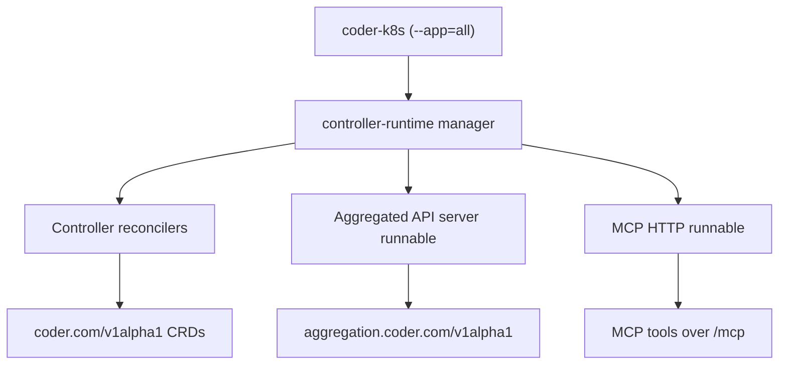
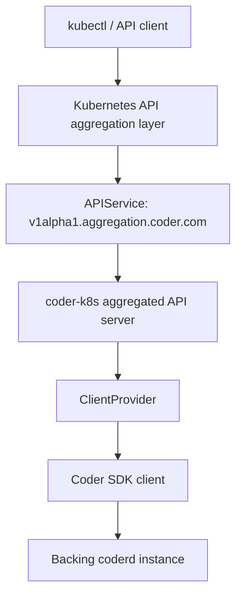

# Architecture

`coder-k8s` is one Go binary. The `--app` flag picks which components run; it defaults to `all`.

| `--app` | Runs |
| --- | --- |
| `all` (default) | Controller, aggregated API server, and MCP server in one process |
| `controller` | Controller-runtime manager and reconcilers |
| `aggregated-apiserver` | Aggregated API server (`aggregation.coder.com/v1alpha1`) |
| `mcp-http` | MCP HTTP server |

## All-in-one mode

In `all` mode, `internal/app/allapp` creates one controller-runtime manager with one shared cache. It registers the reconcilers, then starts the aggregated API server and MCP server as non-leader runnables. One process, one cache, coordinated startup.

```mermaid
graph TD
  entry["coder-k8s (--app=all)"] --> mgr["controller-runtime manager"]
  mgr --> ctrl["Controller reconcilers"]
  mgr --> agg["Aggregated API server runnable"]
  mgr --> mcp["MCP HTTP runnable"]

  ctrl --> crds["coder.com/v1alpha1 CRDs"]
  agg --> api["aggregation.coder.com/v1alpha1"]
  mcp --> tools["MCP tools over /mcp"]
```

## Components

| | Controller | Aggregated API server | MCP server |
| --- | --- | --- | --- |
| **Code** | `internal/app/controllerapp/`, `internal/controller/` | `internal/app/apiserverapp/`, `internal/aggregated/storage/`, `internal/aggregated/coder/` | `internal/app/mcpapp/` |
| **Listens on** | `:8081` (`/healthz`, `/readyz`) | `:6443` HTTPS (default) | `:8090` (`/mcp`, `/healthz`, `/readyz`) |
| **Resources** | `CoderControlPlane`, `CoderProvisioner`, `CoderWorkspaceProxy` | `coderworkspaces`, `codertemplates` | Tools for control planes, templates, workspaces, events, pod logs, and run state |

### Controller

Uses controller-runtime with leader election. For each `CoderControlPlane`, it creates or updates a Deployment and Service in the same namespace, then writes status such as `status.url`, `status.phase`, and the operator token reference.

### Aggregated API server

Storage is backed by the Coder SDK, not memory or etcd: each request becomes a Coder API call. See [Aggregated API behavior](../reference/aggregated-api-behavior.md) for the consequences.

How it finds its Coder backend:

- **`all` mode:** `ControlPlaneClientProvider` discovers eligible `CoderControlPlane` resources and reads their operator token Secrets dynamically.
- **Standalone mode:** static flags `--coder-url`, `--coder-session-token`, and `--coder-namespace`.

```mermaid
graph TD
  client["kubectl / API client"] --> kube["Kubernetes API aggregation layer"]
  kube --> apisvc["APIService: v1alpha1.aggregation.coder.com"]
  apisvc --> agg["coder-k8s aggregated API server"]
  agg --> provider["ClientProvider"]
  provider --> sdk["Coder SDK client"]
  sdk --> coderd["Backing coderd instance"]
```

## Manifests

| Path | Contents |
| --- | --- |
| `config/crd/bases/` | Generated CRDs for `CoderControlPlane`, `CoderProvisioner`, `CoderWorkspaceProxy` |
| `config/rbac/` | ServiceAccount, `manager-role`, and bindings (including auth-delegator) |
| `deploy/deployment.yaml` | The `coder-k8s` Deployment (defaults to `--app=all`) |
| `deploy/apiserver-service.yaml`, `deploy/apiserver-apiservice.yaml` | Expose the aggregated API |
| `deploy/mcp-service.yaml` | MCP Service on port `8090` |
