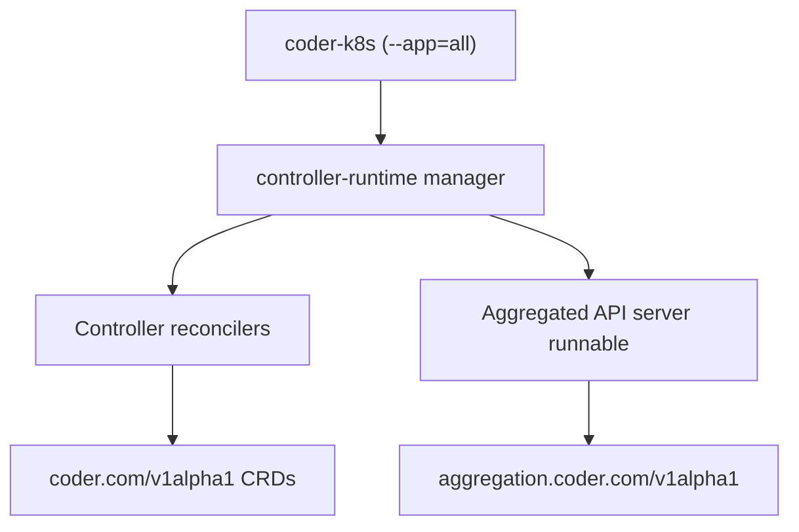
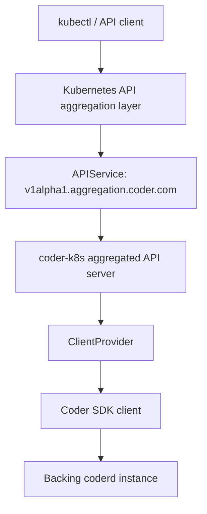

# Architecture

`coder-k8s` is one Go binary. The `--app` flag selects the components that run. The default value is `all`.

| `--app` | Runs |
| --- | --- |
| `all` (default) | The controller and the aggregated API server in one process |
| `controller` | The controller-runtime manager and the reconcilers |
| `aggregated-apiserver` | The aggregated API server (`aggregation.coder.com/v1alpha1`) |
| `mcp-http` | The MCP HTTP server. Only this mode runs it, and it requires `--mcp-token-file`. |

## All-in-one mode

In `all` mode, `internal/app/allapp` creates one controller-runtime manager with one shared cache. `allapp` registers the reconcilers with the manager. Then it adds the aggregated API server to the manager as a runnable that does not need leader election. The result is one process, one cache, and one startup sequence.

`all` mode does not include the MCP server, because the MCP server acts with the authority of the operator. To run it, you must set `--app=mcp-http` on purpose.

```mermaid
graph TD
  entry["coder-k8s (--app=all)"] --> mgr["controller-runtime manager"]
  mgr --> ctrl["Controller reconcilers"]
  mgr --> agg["Aggregated API server runnable"]

  ctrl --> crds["coder.com/v1alpha1 CRDs"]
  agg --> api["aggregation.coder.com/v1alpha1"]
```

## Components

| | Controller | Aggregated API server | MCP server |
| --- | --- | --- | --- |
| Code | `internal/app/controllerapp/`, `internal/controller/` | `internal/app/apiserverapp/`, `internal/aggregated/storage/`, `internal/aggregated/coder/` | `internal/app/mcpapp/` |
| Listens on | `:8081` (`/healthz`, `/readyz`) | `:6443` HTTPS (default) | `127.0.0.1:8090` only. `/mcp` requires the bearer token. `/healthz` and `/readyz` do not. |
| Resources | `CoderControlPlane`, `CoderProvisioner`, `CoderWorkspaceProxy` | `coderworkspaces`, `codertemplates` | Tools for control planes, templates, workspaces, events, pod logs, and run state |

### Controller

The controller uses controller-runtime with leader election. For each `CoderControlPlane`, it creates or updates a Deployment and a Service in the same namespace. Then it writes the status, for example `status.url`, `status.phase`, and the reference to the operator token.

### Aggregated API server

The storage of the aggregated API server is the Coder SDK, not memory or etcd. Each request becomes a call to the Coder API. For the effects of this design, see [Aggregated API behavior](../reference/aggregated-api-behavior.md).

The calls to Coder use the operator credentials of the control plane. Thus the server checks each Kubernetes caller first:

- It uses delegated authentication. It accepts the front-proxy client certificate of kube-apiserver, and it uses TokenReview for bearer tokens.
- It uses delegated authorization (SubjectAccessReview).
- If these checks are not available, the server does not allow the request (it fails closed).
- Only the exact paths `/healthz`, `/livez`, and `/readyz` answer callers that are not authenticated.

For the full rules, see [How callers are checked](../how-to/deploy-aggregated-apiserver.md#how-callers-are-checked).

The server does not map Kubernetes users to Coder users. Thus Kubernetes RBAC on `aggregation.coder.com` in a namespace gives owner-equivalent access in the Coder deployment of the control plane that serves that namespace.

The server finds its Coder backend in one of two ways:

- `all` mode: `ControlPlaneClientProvider` finds the eligible `CoderControlPlane` resources. For each request, it reads the operator token Secret of the matching control plane.
- Standalone mode: you set the static flags `--coder-url`, `--coder-session-token`, and `--coder-namespace`.

```mermaid
graph TD
  client["kubectl / API client"] --> kube["Kubernetes API aggregation layer"]
  kube --> apisvc["APIService: v1alpha1.aggregation.coder.com"]
  apisvc --> agg["coder-k8s aggregated API server"]
  agg --> provider["ClientProvider"]
  provider --> sdk["Coder SDK client"]
  sdk --> coderd["Backing coderd instance"]
```

## Manifests

| Path | Contents |
| --- | --- |
| `config/crd/bases/` | The generated CRDs for `CoderControlPlane`, `CoderProvisioner`, and `CoderWorkspaceProxy` |
| `config/rbac/` | The `coder-k8s` ServiceAccount, the `manager-role` ClusterRole, and the bindings (including auth-delegator) |
| `config/apiserver-standalone/` | For standalone `--app=aggregated-apiserver`: the `coder-k8s-apiserver` ServiceAccount, its RBAC, and the placeholder Secret for the serving CA |
| `deploy/deployment.yaml` | The `coder-k8s` Deployment (default `--app=all`) |
| `deploy/apiserver-service.yaml`, `deploy/apiserver-apiservice.yaml` | The Service and APIService that make the aggregated API available |
